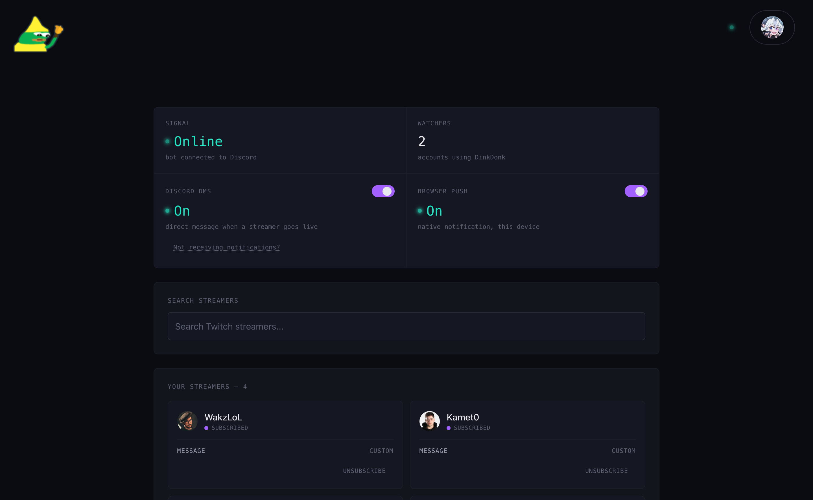
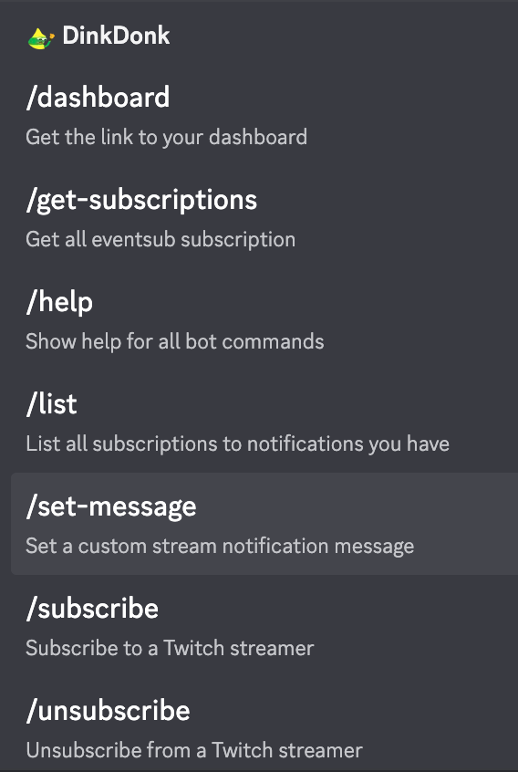

<div align="center">
  

  # DinkDonk

  ### Know the second a streamer you follow goes live.

  [](https://dinkdonk.donuts.ovh)
  [](#license)

  
  
  
  
  
  
  
  

  **[🚀 Try it live](https://dinkdonk.donuts.ovh)** · [Discord commands](#-discord-commands) · [Architecture](ARCHITECTURE.md) · [Deployment](DEPLOYMENT.md)
</div>

<br />

DinkDonk tells you the moment a Twitch streamer you follow goes live — without you having to check Twitch.

Sign in, pick the streamers you care about, and choose how you want to hear about it: a Discord DM, a browser push notification, or just watching your dashboard update in real time. No more missing a stream because you weren't scrolling Twitch at the right moment.

## Contents

- [Screenshots](#screenshots)
- [What you can do](#what-you-can-do)
- [Signing in](#signing-in)
- [💬 Discord commands](#-discord-commands)
- [Notification channels](#notification-channels)
- [🛠️ For developers](#️-for-developers)
  - [Quick local setup](#quick-local-setup)
  - [Discord slash commands (deployment)](#discord-slash-commands-deployment)
- [Secrets](#secrets)
- [License](#license)

---

## Screenshots

<p align="center">
  
  <br />
  <sub>The dashboard — live status, notification toggles, and your subscriptions.</sub>
</p>

<p align="center">
  
  &nbsp;&nbsp;
  
  <br />
  <sub>Discord slash commands &nbsp;·&nbsp; installed as a PWA on mobile</sub>
</p>

## What you can do

- 🔔 **Track streamers.** Search Twitch and subscribe to up to 200 streamers.
- 📡 **Get notified your way.** Turn on Discord DMs, browser push notifications, or both — independently, per channel.
- ✍️ **Custom messages.** Set your own notification text per streamer (e.g. "don't forget the raffle!").
- ⚡ **Watch it happen live.** The dashboard updates the instant a streamer goes live, no refresh needed.
- 💬 **Use it from Discord.** Everything the dashboard does is also available as slash commands, if you'd rather not leave Discord.
- 📲 **Install it.** DinkDonk is installable as an app on desktop and mobile (Add to Home Screen / Install App) — no app store needed.

## Signing in

DinkDonk uses Twitch's own EventSub system to know the instant a streamer goes live, so no polling and no delay. Sign in with your Discord account (always available); a given deployment may also offer Google or Twitch sign-in.

## 💬 Discord commands

If you'd rather manage things without opening the dashboard:

| Command              | What it does                                                                 |
| -------------------- | ---------------------------------------------------------------------------- |
| `/subscribe`         | Subscribe to a Twitch streamer, with an optional custom notification message |
| `/unsubscribe`       | Stop getting notified about a streamer                                       |
| `/list`              | See who you're subscribed to                                                 |
| `/set-message`       | Change the custom message for a streamer you're already subscribed to        |
| `/dashboard`         | Get a link straight to your dashboard                                        |
| `/get-subscriptions` | Same as `/list`, phrased for scripting/automation use                        |
| `/help`              | List available commands                                                      |

## Notification channels

| Channel               | Notes                                                                                                                                                                 |
| ---------------------- | ---------------------------------------------------------------------------------------------------------------------------------------------------------------------- |
| 💬 **Discord DMs**    | The bot needs to share a server with you and be able to DM you. If DMs aren't working, the dashboard's notification settings can tell you why and let you re-check. |
| 🔔 **Browser push**   | Works even when DinkDonk isn't open in a tab. Supported on desktop Chrome/Firefox/Edge and, on iOS/iPadOS, after adding DinkDonk to your Home Screen.               |
| 📺 **Live dashboard** | No notification setup required; just have the dashboard open and it updates itself.                                                                                 |

---

## 🛠️ For developers

DinkDonk is a React + TypeScript frontend, a Node.js + Express + TypeScript backend, Firestore for persistence, and Socket.IO for realtime updates, deployed behind Caddy with Docker Compose.

```txt
client/     React + Vite frontend
server/     Node.js + Express backend
deploy/     Docker Compose, Caddy, environment/secrets layout
```

- **[ARCHITECTURE.md](ARCHITECTURE.md)** — how the codebase is organized, module by module.
- **[DEPLOYMENT.md](DEPLOYMENT.md)** — running your own instance (dev, staging, production).
- **[client/README.md](client/README.md)** — frontend-specific commands and structure.

### Quick local setup

```bash
cd server && npm install
cd ../client && npm install
```

Create `server/.env.development` (backend credentials, Firebase dev credentials) and `client/.env` (public `VITE_*` values only).

Recommended — Docker Compose, which also gives you Redis and the Prometheus/Grafana monitoring stack:

```bash
docker compose -f deploy/compose.dev.yml up --build   # first run / after dependency changes
docker compose -f deploy/compose.dev.yml up            # normal development
```

Without Docker: `REDIS_URL` is optional (every Redis-backed feature falls back to an in-process equivalent when it's unset), so `cd server && npm run dev` works standalone.

In another terminal:

```bash
cd client
npm run dev
```

Open [http://localhost:5000](http://localhost:5000).

Full production/staging setup lives in **[DEPLOYMENT.md](DEPLOYMENT.md)**.

### Discord slash commands (deployment)

Slash command registration is manual and deliberately not run on every backend startup:

```bash
cd server
npm run deploy:commands
```

---

## Secrets

Never commit:

- Discord bot token
- Discord client secret
- Twitch client secret
- Twitch webhook secret
- Firebase service account JSON
- Session secret
- Token encryption key
- Metrics token

Production secrets live in `deploy/secrets/` (staging: `deploy/secrets-staging/`) — only `.gitkeep` should ever be committed from those directories. See `deploy/.env.example` for the full list of what each deployment needs.

---

## License

Private project.

<div align="center">
  <sub>Built with 💛 for streams you don't want to miss.</sub>
</div>
