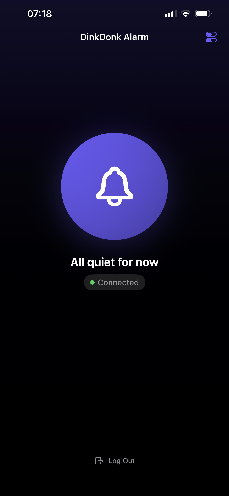
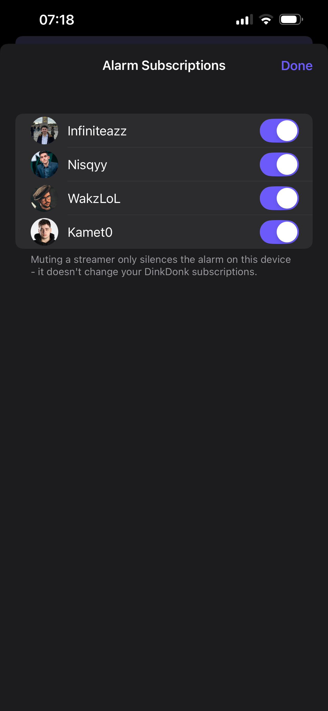

<div align="center">
  

# DinkDonk Alarm

### The iOS companion app


</div>

<br />

A tiny native iOS app that turns a `streamer_live_changed` event from your DinkDonk deployment into a genuine alarm — one that plays through the phone's Ring/Silent switch, which no web push notification or Discord notification can do (that's an iOS platform restriction, not a DinkDonk limitation). See [`Sources/AlarmAudioController.swift`](Sources/AlarmAudioController.swift) for why this works and what it can't do.

See the root **[README](../../README.md)** for what DinkDonk itself does.

<p align="center">
  
  &nbsp;&nbsp;
  
  <br />
  <sub>Connection status &nbsp;·&nbsp; per-streamer alarm subscriptions</sub>
</p>

## Contents

- [DinkDonk Alarm](#dinkdonk-alarm)
  - [The iOS companion app](#the-ios-companion-app)
  - [Contents](#contents)
  - [Prerequisites](#prerequisites)
  - [Why no Apple Push Notifications (APNs)](#why-no-apple-push-notifications-apns)
  - [1. Open the project](#1-open-the-project)
  - [2. Sign it](#2-sign-it)
  - [3. Point it at your deployment](#3-point-it-at-your-deployment)
  - [4. Build and run on your phone](#4-build-and-run-on-your-phone)
  - [Using it](#using-it)
  - [Known limitations](#known-limitations)

---

## Prerequisites

- A Mac with Xcode installed (built and tested against Xcode 16.2 / the iOS
  18.2 SDK, targeting a minimum deployment of iOS 17.0).
- A free Apple ID is enough to build and install this on your own phone.
  Two tradeoffs of not paying for the $99/yr Apple Developer Program:
  - The install expires after **7 days** and needs re-running from Xcode
    (plugged in or over Wi-Fi) to keep working.
  - No remote push notifications (this app doesn't use any — see below).
- [Homebrew](https://brew.sh) + `xcodegen` (`brew install xcodegen`) — only
  needed if you change `project.yml` or add/remove a file under `Sources/`
  and need to regenerate the `.xcodeproj`. A fresh checkout doesn't need
  this; the generated project is already checked in.

## Why no Apple Push Notifications (APNs)

Generating APNs push keys requires a paid Apple Developer Program account.
Instead, this app keeps its own persistent Socket.IO connection to your
DinkDonk server (`LiveSocketManager.swift`) — the same realtime channel the
web dashboard already uses — and stays alive in the background via a
looping `AVAudioSession(.playback)` (`AlarmAudioController.swift`), a
long-established technique background-audio apps use to stay resident
without push. No backend changes were needed for any of this.

## 1. Open the project

The `.xcodeproj` is checked in, generated by
[xcodegen](https://github.com/yonaskolb/XcodeGen) from `project.yml` rather
than hand-written — a hand-edited project file with no easy way to
test-compile it is a good way to end up with something subtly broken. Just
open it:

```bash
open ios/DinkDonkAlarm/DinkDonkAlarm.xcodeproj
```

`project.yml` already declares: a SwiftUI iOS app target, minimum deployment
iOS 17.0, the **Background Modes → Audio** capability (`UIBackgroundModes:
[audio]`, baked into `Generated/Info.plist` — this is what lets
`AlarmAudioController`'s keep-alive loop hold the process open while the app
is backgrounded or the phone is locked), and an SPM dependency on
[socket.io-client-swift](https://github.com/socketio/socket.io-client-swift)
(up to next major from `16.0.0`). None of that needs setting up by hand.

If you add/remove a source file under `Sources/`, or change `project.yml`,
regenerate before building:

```bash
brew install xcodegen   # once
cd ios/DinkDonkAlarm && xcodegen generate
```

## 2. Sign it

`project.yml` deliberately leaves `DEVELOPMENT_TEAM` unset — it's tied to a
personal Apple ID/Team ID and shouldn't be committed. Select the
`DinkDonkAlarm` target → **Signing & Capabilities** tab → set **Team** to
your personal Apple ID (free tier is fine; Xcode mints a free provisioning
profile). `CODE_SIGN_STYLE` is already `Automatic`, so that's the only field
you need to touch.

If Xcode writes your team ID back into `project.pbxproj` as a result (it
will, the first time it signs), re-run `xcodegen generate` before your next
commit to strip it back out — `project.yml` staying team-less is what keeps
it out of git.

## 3. Point it at your deployment

Edit `Sources/Config.swift` and set `serverURL` to your DinkDonk
deployment's public origin — the same value as `SERVER_URL`/`CLIENT_ORIGIN`
in `deploy/.env.example`, e.g. `https://your-domain.com`. Must be HTTPS in
production (App Transport Security blocks plain HTTP by default — that's
correct behavior, not something to work around).

## 4. Build and run on your phone

Plug your iPhone in (or select it wirelessly), pick it as the run
destination, and hit Run. First launch: **Settings → General → VPN & Device
Management** on the phone → trust your developer certificate.

## Using it

1. Open the app, log in with Discord (same account as your DinkDonk
   dashboard) — this runs in a WKWebView, identical to the web login.
2. Leave it running in the background. The status screen shows a colored
   badge for the live connection state ("Connected", "Connecting…",
   "Disconnected — retrying…").
3. Tap the toggle icon (top-right) to open **Alarm Subscriptions** and
   mute/unmute the alarm per streamer. This is a local, on-device
   preference (`AlarmPreferencesStore.swift`) — it doesn't touch your actual
   DinkDonk subscriptions, so muting someone here only silences this
   device's alarm for them.
4. When a streamer you're subscribed to (and haven't muted) goes live, the
   app plays a loud, looping alarm — even with the phone muted — and shows
   a lock-screen notification. Tap **Stop Alarm** (in-app or on the
   notification) to silence it.

## Known limitations

- **Media volume, not ringer volume.** `.playback` bypasses the mute
  switch, but it still uses the phone's media volume (the one the physical
  buttons adjust during playback). If that's turned all the way down, the
  alarm is silent. Keep it up.
- **Long idle stretches can get the background session suspended by iOS.**
  Reopening the app reconnects immediately (`AppState.ensureConnected()`
  runs on every foreground). Not bulletproof, but fine for personal use.
- **7-day reinstall** on a free Apple ID, as above.
- **Muted subscriptions are per-device.** They're stored in `UserDefaults`,
  not synced anywhere — a reinstall or a second device starts with every
  subscription unmuted.
- If reliability ever becomes a real problem, iOS 26's **AlarmKit**
  framework gives true system-alarm behavior (dedicated ringer volume,
  guaranteed firing) and doesn't need a paid account either — it'd replace
  just `AlarmAudioController`, nothing else in this app.
